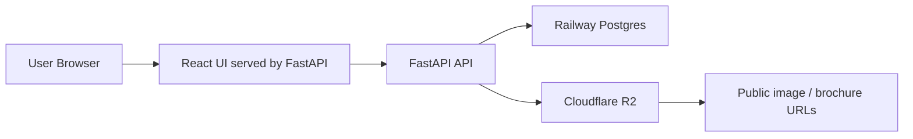

# Real Estate Office MVP

사무실/상가/주거 중개 업무를 보조하기 위한 부동산 중개사용 웹앱 MVP입니다.  
소개서 작성, 고객 관리, 일정 관리, 계산기, 사진 편집, 주소/지번 허브를 한 화면 흐름 안에서 사용할 수 있도록 구성했습니다.

> 현재는 소규모 베타 테스트용 MVP이며, 회원가입/로그인 후 개인별 저장 데이터를 관리하는 구조입니다.

## Live Demo

- App: https://real-estate-mvp-production.up.railway.app
- Storage health check: https://real-estate-mvp-production.up.railway.app/health/storage

## Key Features

- **소개서 작성**
  - 대표사진/추가사진 업로드
  - 보증금, 월세, 관리비, 면적, 층수, 주차, 연락처 입력
  - HTML 소개서 생성
  - 생성된 소개서 열기 및 인쇄/PDF 저장 흐름 지원

- **회원가입/로그인**
  - 공개 도구는 로그인 없이 접근 가능
  - 저장이 필요한 기능은 로그인 후 사용
  - JWT 기반 인증
  - 사용자별 데이터 분리

- **고객/일정 관리**
  - 고객 요청 조건, 우선순위, 상담 상태 저장
  - 일정, 미팅, 메모 저장

- **파일 저장**
  - 업로드 이미지와 생성된 소개서 HTML은 Cloudflare R2에 저장
  - DB에는 파일 URL과 storage key 저장
  - `/health/storage`로 현재 저장소 상태 확인 가능

- **배포**
  - React 정적 빌드를 FastAPI에서 서빙
  - Railway에서 Docker 기반 배포
  - Railway Postgres 사용
  - Cloudflare R2 사용

## Tech Stack

| Area | Stack |
| --- | --- |
| Frontend | React, Vite, CSS |
| Backend | FastAPI, SQLAlchemy |
| Auth | JWT, password hashing |
| Database | PostgreSQL on Railway, SQLite fallback for local |
| Object Storage | Cloudflare R2, boto3 S3-compatible API |
| Deployment | Docker, Railway |

## Architecture



## Project Structure

```text
.
├── backend/
│   ├── main.py
│   ├── db.py
│   ├── dependencies.py
│   ├── routers/
│   │   ├── auth.py
│   │   ├── brochures.py
│   │   ├── customers.py
│   │   ├── properties.py
│   │   └── schedules.py
│   └── services/
│       ├── auth.py
│       ├── seed.py
│       └── storage.py
├── frontend/
│   ├── src/
│   │   ├── auth/
│   │   ├── cards/
│   │   ├── components/
│   │   ├── form/
│   │   ├── pages/
│   │   └── styles/
│   └── package.json
├── Dockerfile
├── DEPLOYMENT.md
└── README.md
```

## Environment Variables

Production requires these variables on the Railway app service:

```env
AUTH_SECRET=change-this-to-a-long-random-string
DATABASE_URL=postgresql://...

STORAGE_BACKEND=r2
R2_ACCOUNT_ID=...
R2_ACCESS_KEY_ID=...
R2_SECRET_ACCESS_KEY=...
R2_BUCKET=real-estate-mvp
R2_PUBLIC_BASE_URL=https://pub-xxxx.r2.dev
```

Optional seed account variables:

```env
ADMIN_USERNAME=admin
ADMIN_PASSWORD=change-this-admin-password
VIEWER_USERNAME=viewer
VIEWER_PASSWORD=change-this-viewer-password
```

## Local Development

### Backend

```bash
cd backend
python -m venv .venv
.venv\Scripts\activate
pip install -r requirements.txt
python -m uvicorn main:app --reload --host 127.0.0.1 --port 8000
```

### Frontend

```bash
cd frontend
npm install
npm run dev
```

Frontend dev server:

```text
http://127.0.0.1:5173
```

Backend API:

```text
http://127.0.0.1:8000
```

## Deployment Notes

1. Push to GitHub `main`.
2. Railway automatically builds the Docker image.
3. Dockerfile builds the Vite frontend.
4. FastAPI serves the built frontend and API from one Railway service.
5. Railway Postgres stores users, customers, schedules, properties, and brochure metadata.
6. Cloudflare R2 stores uploaded images and generated brochure HTML files.

Check storage mode after deployment:

```text
/health/storage
```

Expected production response:

```json
{
  "active_backend": "r2",
  "storage_backend": "r2",
  "r2_enabled": true,
  "r2_required": true,
  "missing_r2_variables": []
}
```

## Portfolio Highlights

- Built a full-stack MVP from a frontend prototype into a deployed web app.
- Added authentication and user-scoped data persistence.
- Migrated local file storage concerns to Cloudflare R2 for durable object storage.
- Connected Railway Postgres and production deployment with Docker.
- Added storage health checks to prevent silent fallback to temporary server disk.
- Kept the MVP structure simple enough for iteration while separating routers, services, and database code.

## Roadmap

- Admin dashboard for user and data management
- Better property search and filtering
- Custom domain setup
- Image editing result handoff into brochure creation
- More robust PDF export flow
- Automated tests for auth, storage, and brochure creation
