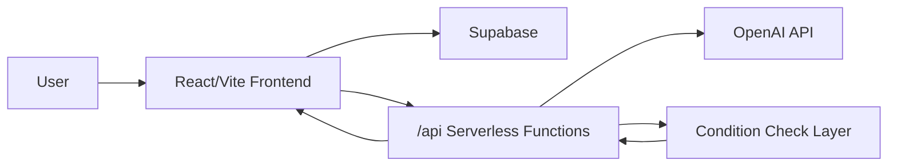

# AgentNote

부동산 중개 업무를 위한 고객관리, 일정관리, 매물 소개서 작성, 수수료 정산, AI 상담 브리핑 통합 MVP입니다.

실제 중개 업무 흐름을 기준으로 만든 SaaS형 웹 애플리케이션이며, 현재는 포트폴리오 제출용 프로젝트로 정리했습니다.

## Demo

- Production: https://agentnote.co.kr
- Vercel: https://real-estate-mvp-navy.vercel.app
- Repository: https://github.com/w00suk1234/real-estate-mvp

## Project Summary

AgentNote는 부동산 중개사가 반복적으로 처리하는 고객 상담, 일정 기록, 매물 비교, 소개서 작성, 잔금/정산 확인 업무를 한 화면 흐름으로 관리할 수 있게 만든 React 기반 업무 도구입니다.

단순 CRUD가 아니라 실제 상담 업무의 다음 단계를 이어갈 수 있도록 아래 기능을 중심으로 구성했습니다.

- 고객 조건과 상담 메모 관리
- 일정관리와 잔금일정 자동 정리
- 저장 매물 기반 AI 후보 추천
- 고객 조건과 후보 매물 비교
- OpenAI 기반 상담 브리핑 생성
- 고객 메모 저장, 일정 생성, 소개서 작성 이동 같은 승인형 AI 후속 액션
- 고객용 매물 소개서 PDF 생성
- 수수료 정산 예정/완료 관리

## Screenshots

포트폴리오 제출용으로는 실제 화면 이미지가 있으면 더 좋습니다. 아래 파일명을 기준으로 `docs/screenshots/` 폴더에 캡처 이미지를 추가하면 README에 바로 연결할 수 있습니다.

| 추천 이미지 | 내용 |
| --- | --- |
| `01-dashboard.png` | 일정관리 또는 전체 업무 흐름 |
| `02-ai-briefing.png` | AI 브리핑 결과와 추천 액션 |
| `03-brochure-maker.png` | 소개서 작성 + 미리보기 화면 |
| `04-settlement.png` | 정산 예정/정산 목록 화면 |
| `05-customer-management.png` | 고객관리 화면 |

이미지를 추가한 뒤 아래처럼 사용할 수 있습니다.

```md

```

## Main Features

### Customer Management

- 고객 등록, 수정, 삭제
- 희망 지역, 예산, 월세, 면적, 용도, 주차 조건 관리
- 상담 메모 기반 고객 히스토리 관리
- AI 브리핑 결과를 고객 메모에 날짜와 함께 append 저장

### Schedule Management

- 월간 달력 UI
- 고객 인입, 미팅, 계약금입금, 계약서일정, 잔금일 관리
- 고객과 연결된 일정 생성
- 잔금일 일정 기반 정산 예정 항목 자동 표시

### AI Briefing

- 기존 사이드바의 `AI 브리핑` 메뉴에 OpenAI API 연결
- 프론트엔드는 내부 API `/api/ai-briefing`만 호출
- OpenAI API Key는 서버리스 API에서만 사용
- 서버에서 고객 필수 조건과 매물 조건을 먼저 검증
- 면적, 예산, 월세, 주차, 용도 조건을 `conditionChecks`로 계산
- 필수 조건 미달 매물은 `fitScore`가 과하게 높아지지 않도록 제한
- 결과 UI:
  - 고객 조건 요약
  - 추천 요약
  - 조건 충족도 비교 결과
  - 상담 메모
  - 고객 발송 문구 초안
  - 추가 확인사항
  - 다음 작업 추천

### Agentic AI Actions

AI가 자동으로 DB를 수정하지 않고, 사용자가 버튼을 눌러 승인해야 실행되는 구조입니다.

- 고객 메모에 저장
- 상담 일정 만들기
- 소개서 초안 작성 화면으로 이동
- 추가 매물 찾기
- 고객 발송 문구 복사
- 실행 완료 상태를 세션에 보존해 화면 복귀 후 중복 실행을 줄임

### Property Recommendation

- 고객 조건을 기준으로 저장 매물 중 가까운 후보를 자동선정
- OpenAI 호출 없이 1차 점수 계산으로 후보 2~5개 선택
- 면적, 가격/보증금, 월세, 지역, 용도, 주차 조건을 기준으로 정렬
- 최종 상담 문안 생성 단계에서만 OpenAI 호출

### Brochure Maker

- 매물 정보 입력
- 사진 업로드 및 이미지 압축
- 고객용 소개서 미리보기
- PDF 다운로드
- 섹션 탭 기반 입력 UI
- 오른쪽 미리보기 패널과 왼쪽 입력 폼의 스크롤 흐름 개선

### Settlement

- 잔금일 기준 1주일 내 정산 예정 표시
- 월별 정산 목록 조회
- 전체보기/월 이동/이번 달 필터
- Supabase 정산 테이블이 아직 없을 때도 고객관리와 일정 데이터를 기준으로 정산 대기 항목 표시
- 정산 직접 추가 폼 제공

## Tech Stack

| Area | Stack |
| --- | --- |
| Frontend | React 19, Vite |
| Styling | CSS Modules 성격의 단일 테마 CSS |
| Backend/API | Vercel Serverless Functions |
| AI | OpenAI API, 서버 조건 검증 레이어 |
| Database | Supabase |
| PDF | html2canvas, jsPDF |
| Test | Node test runner, ESLint |
| Deploy | Vercel |

## Architecture



## Project Structure

```txt
agentnote-co-kr/
├─ frontend/
│  ├─ api/
│  │  ├─ ai-briefing.js
│  │  ├─ ai-briefings/
│  │  └─ _shared/
│  ├─ src/
│  │  ├─ pages/
│  │  │  ├─ AIBriefingPage.jsx
│  │  │  ├─ AIPropertyRecommendPage.jsx
│  │  │  ├─ BriefingMakerPage.jsx
│  │  │  ├─ CustomersPage.jsx
│  │  │  ├─ SchedulesPage.jsx
│  │  │  └─ SettlementPage.jsx
│  │  ├─ services/
│  │  ├─ utils/
│  │  ├─ components/
│  │  ├─ auth/
│  │  └─ styles/
│  ├─ package.json
│  └─ vercel.json
├─ chrome-extension/
├─ backend/
├─ docs/
│  └─ screenshots/
└─ README.md
```

## OpenAI Security

OpenAI API Key는 프론트엔드에 포함하지 않습니다.

- `VITE_OPENAI_API_KEY` 사용 금지
- 브라우저는 `/api/ai-briefing`만 호출
- 실제 OpenAI 호출은 Vercel Serverless Function에서 처리
- 고객 전화번호, 이메일 등 민감정보는 AI 요청에서 제외
- 없는 정보는 생성하지 않고 `확인 필요`로 표시

## AI Safety Layer

AI 브리핑은 OpenAI의 문장 생성 능력을 사용하지만, 추천 점수의 핵심 판단은 서버에서 먼저 계산합니다.

- 면적 필수 조건 미달 시 `높음` 추천 제한
- 예산 명확 초과 시 `높음` 추천 제한
- 용도 불일치 시 `높음` 추천 제한
- 필수 조건 2개 이상 미달 시 낮은 우선순위 처리
- 정보 부족 항목은 `확인 필요`로 유지

이 구조를 통해 AI가 그럴듯한 문장으로 부적합 매물을 추천하는 위험을 줄였습니다.

## Local Development

```bash
cd frontend
npm install
npm run dev
```

## Environment Variables

Vercel 환경변수 또는 로컬 서버 환경에 설정합니다. OpenAI 키는 프론트엔드 번들에 노출되면 안 됩니다.

```env
OPENAI_API_KEY=server-side-only
VITE_SUPABASE_URL=your-supabase-url
VITE_SUPABASE_ANON_KEY=your-supabase-anon-key
```

## Scripts

```bash
cd frontend
npm run dev
npm run build
npm run lint
npm test
```

## Deployment

이 프로젝트는 Vercel 배포를 기준으로 구성되어 있습니다.

- 프론트엔드: Vite build
- API: `frontend/api` 하위 Vercel Serverless Functions
- 환경변수: Vercel Project Settings에서 관리

## Portfolio Highlights

- 실제 업무 도메인을 분석해 고객관리, 일정, 소개서, 정산, AI 상담 흐름을 하나의 제품으로 연결했습니다.
- OpenAI API를 단순 텍스트 생성이 아니라 서버 검증 레이어와 결합해 실무 리스크를 줄였습니다.
- AI 액션은 자동 실행이 아니라 사용자 승인 후 실행되는 구조로 설계했습니다.
- Supabase 테이블이 일부 준비되지 않은 상황에서도 고객/일정 데이터를 활용해 화면이 무너지지 않도록 fallback을 구현했습니다.
- 소개서 작성, PDF 생성, AI 브리핑, 정산 예정 등 포트폴리오에서 설명 가능한 기능 밀도가 높은 프로젝트입니다.

## Current Status

사업용 MVP로 시작했지만 현재는 포트폴리오 용도로 정리한 상태입니다. 핵심 업무 흐름과 AI 기능은 구현되어 있으며, 실제 운영 수준으로 확장하려면 권한 관리, 정산 테이블 마이그레이션, 파일 스토리지 정책, 사용자별 데이터 격리 강화가 추가로 필요합니다.

## License

Private portfolio project.
